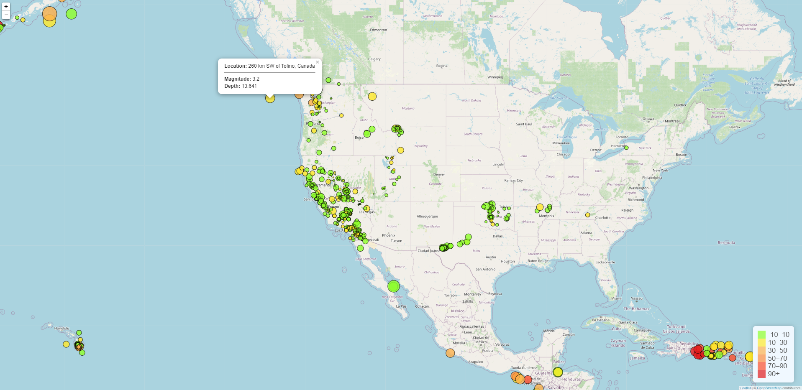
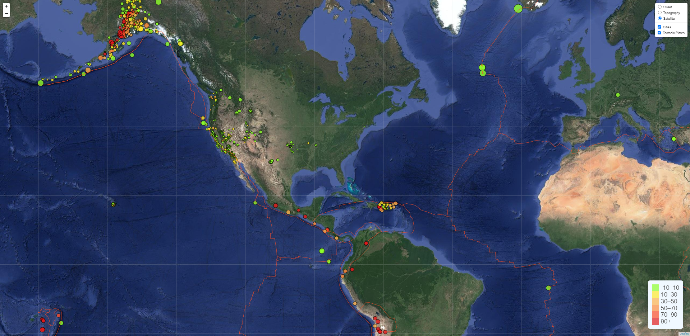

# Visualizing Earthquake Data with Leaflet

## Background

The United States Geological Survey, or USGS for short, is responsible for providing scientific data about natural hazards, the health of our ecosystems and environment, and the impacts of climate and land-use change.

This tool will allow us to visualize their earthquake data, and help them to better educate the public and other government organizations (and hopefully secure more funding) on issues facing our planet.

## Instructions

The instructions for this activity are broken into two parts: 

* Part 1: Create the Earthquake Visualization 
   * The USGS dataset used for visualization. [USGS GeoJSON Feed](https://earthquake.usgs.gov/earthquakes/feed/v1.0/summary/all_week.geojson).

* Part 2: Gather and Plot More Data (Tectonic Plates Data)

### Part 1: Create the Earthquake Visualization

To visualize an earthquake dataset. Complete the following steps:

1. Get your dataset. To do so, follow these steps: 

2. Import and visualize the data by doing the following: 

   * Using Leaflet, create a map that plots all the earthquakes from your dataset based on their longitude and latitude.

       * Data markers reflects the magnitude of the earthquake by their size and the depth of the earthquake by color. Earthquakes with higher magnitudes appears larger, and earthquakes with greater depth appears darker in color.

       * The depth of the earth can be found as the third coordinate for each earthquake.

   * The popups provides additional information about the earthquake when its associated marker is clicked.

   * Legend provides context for your map data.

- - -

### Part 2: Gather and Plot More Data (Techtonic Plates Data)

The second plot illustrate the relationship between tectonic plates and seismic activity. Data on tectonic plates can be found [here](https://raw.githubusercontent.com/fraxen/tectonicplates/master/GeoJSON/PB2002_boundaries.json).

Perform the following tasks: 

* Tectonic plates dataset layer is added on the map in addition to the earthquakes.

* Each dataset is added into separate overlays that can be turned on and off independently.

